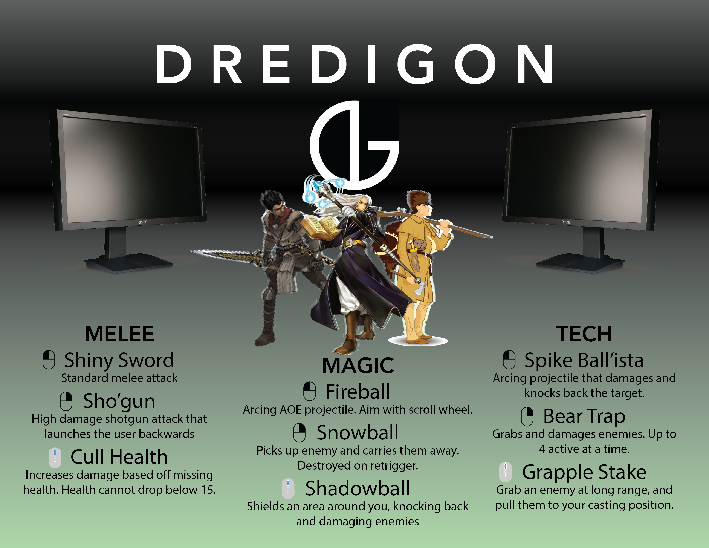

Dredigon was a high school group project by Travis Newbry, Liam Gifford, Ethan Guymon, and Ethan Edwards. It features three playable classes that counter each other in a rock-paper-scissors fashion. Melee beats magic, magic beats tech, tech beats melee. Players can hotswap between classes every time they use their ultimate, which is charged by dealing damage.

The compiled game is in [./DredigonClientv0.3.1](./DredigonClientv0.3.1) and the unity project is in [./Dredigon](./Dredigon).

The project was back in 2022, before any of us understood github. Luckily we understood version numbers well enough for me to find the latest of the many builds I had archived. I showed the game to a friend about a year ago and all the multiplayer still works. Three cheers for peer to peer!

